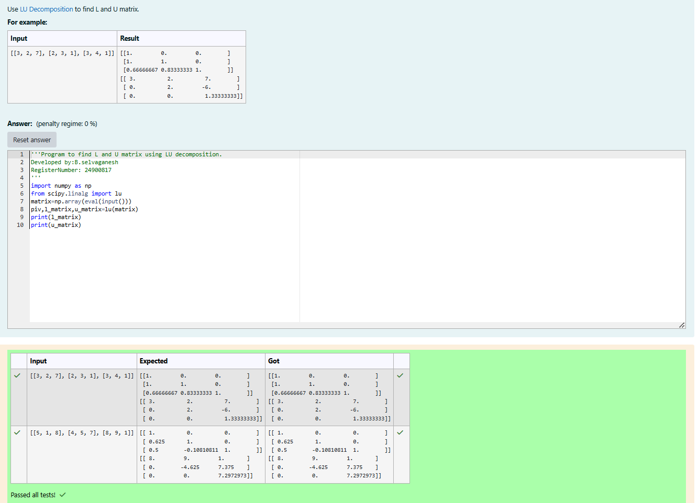
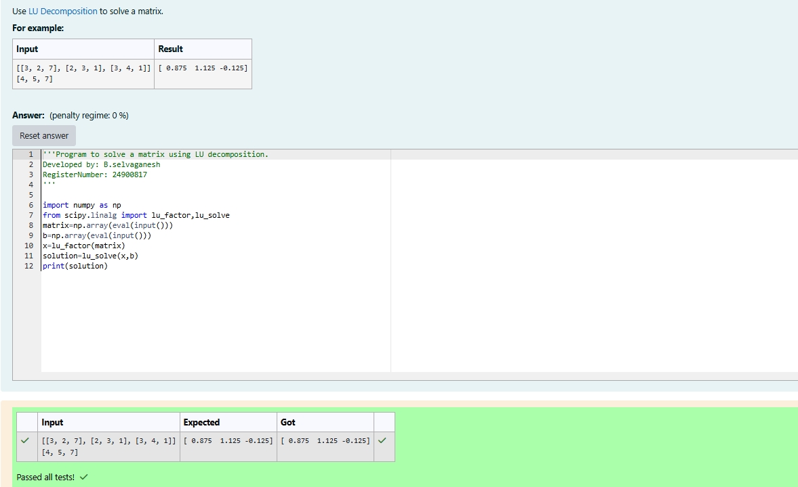

# LU Decomposition 

## AIM:
To write a program to find the LU Decomposition of a matrix.

## Equipments Required:
1. Hardware – PCs
2. Anaconda – Python 3.7 Installation / Moodle-Code Runner

## Algorithm
Step1: Define the package as scipy.linaly import lu

Step2: Get input from user and print L and U matrix by 'print'

Step3: Define a package as "from scipy.linalg import lu_factor,lu_solve" package in that variable

Step4: print the variable 'X'

## Program:
(i) To find the L and U matrix
```
'''Program to find L and U matrix using LU decomposition.
Developed by:B.selvaganesh
RegisterNumber: 24900817
'''
import numpy as np
from scipy.linalg import lu
matrix=np.array(eval(input()))
piv,l_matrix,u_matrix=lu(matrix)
print(l_matrix)
print(u_matrix)
```
(ii) To find the LU Decomposition of a matrix
```
'''Program to solve a matrix using LU decomposition.
Developed by: B.selvaganesh
RegisterNumber: 24900817
'''

import numpy as np
from scipy.linalg import lu_factor,lu_solve
matrix=np.array(eval(input()))
b=np.array(eval(input()))
x=lu_factor(matrix)
solution=lu_solve(x,b)
print(solution)
```

## Output:




## Result:
Thus the program to find the LU Decomposition of a matrix is written and verified using python programming.

